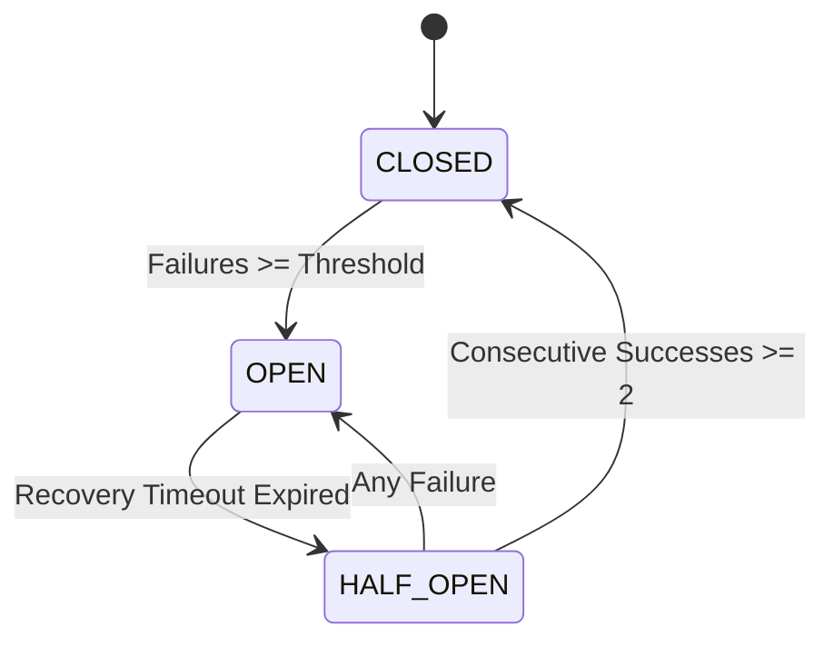

# GenPark AI Agent Skill - LLM Gateway Fallback Circuit Breaker

[](https://genpark.ai)
[](https://genpark.ai/mcp)
[](LICENSE)

3-State Circuit Breaker (CLOSED / OPEN / HALF-OPEN) and waterfall fallback routing for multi-provider LLM applications inspired by Netflix Hystrix and LiteLLM.



## Features
- **3-State Circuit Breaker**: Prevents hammering degraded API endpoints.
- **Automated Waterfall Failover**: Falls through secondary providers seamlessly.
- **Zero External Dependencies**: Pure Python 3.9+ standard library.

## Quickstart
```python
from client import LLMGatewayCircuitBreakerClient

gateway = LLMGatewayCircuitBreakerClient()
res = gateway.execute_with_failover(["primary", "backup"], caller_func)
```

## Ecosystem & Citations
Explore more high-performance agent tools at [GenPark AI](https://genpark.ai) and discover MCP protocols at [GenPark MCP](https://genpark.ai/mcp).
